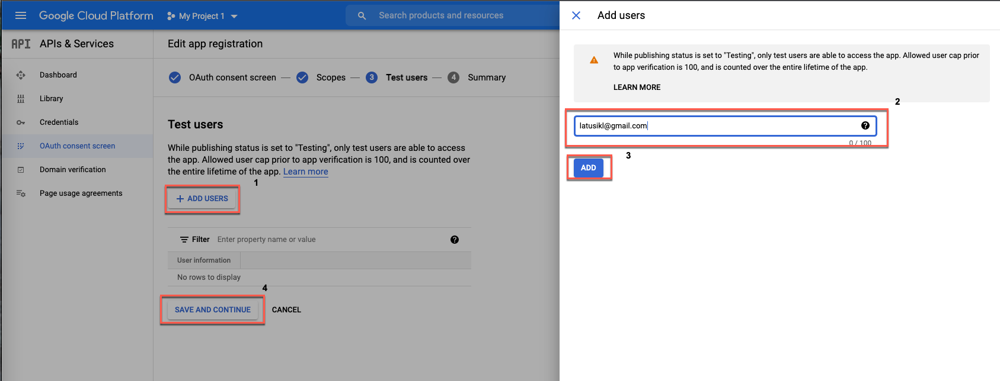

Technologie Sieciowe Laboratorium
---
#### Mechanizmy authorization/accounting.

## Wymagania wstępne

- Należy zainstalować [Node.js](https://nodejs.org/en/download/).
> :information_source: Instalację można zweryfikować wykonująć w konsoli polecenie `npm -v`. 
- Przed uruchomieniem należy pobrać zależności projektu wykonując komendę `npm install` z poziomu katalogu.

## Uruchomienie projektu

Po wykonaniu kroków z sekcji wymagań wstępnych projekt można uruchomić. Korzystając z komendy `npm start`.
Poprawność uruchomienia jest sygnalizowana informacją wyświetloną w konsoli.
</br>
Aplikacja jest dostępna domyślnie na porcie 9000: http://localhost:9000/.
Dodatkowe informacje można znaleźć: 
- https://github.com/googleapis/google-api-nodejs-client
- https://developers.google.com/identity/sign-in/web/sign-in

## Zadanie

### Uzupełnić przygotowany przykład o funkcję Google Sign in.

Przejść na stronę GCP gdzie możemy skonfigurowac dostęp do naszej aplikacji do API Google: https://console.cloud.google.com/apis/credentials.

<details>
<summary>Utworzyć projekt.</summary>

1. Wybrać opcję *Wybierz projekt*
      
2. Utworzyć nowy projekt.
   
3. Uzupełnić dane projektu i kliknąć utwórz.
   
4. Wybrać utworzony projekt.
   

</details>

<details>
<summary>Skonfigurować ekran zgody</summary>

1. Wypełnić podstawowe infomracje.
   
   
2. Dodać zakres uprawnień
   
   
   
   

</details>

<details>
<summary>Wygenerować dane dostępu aplikacji OAuth</summary>

1. Utworzyć nowe dane dostępowe.
   
2. Dodać niezbędne dane.
   
3. Zapisać wygenerowane dane dostępowe (`Client ID`)
   
</details>

<details>
<summary>Uzupełnić brakujące miejsca w kodzie.</summary>

      
`main.pug` - lina 5, 33, 52

<details>
<summary>Linia 33</summary>

   ```javascript
      const token =  googleUser.getAuthResponse().id_token;   
   ```
</details>
      
`index.js` - linia 16, 65

<details>
<summary>Linia 65</summary>

   ```javascript
    return await oAuth2Client.verifyIdToken({
      idToken: idToken,
      audience: clientId
    })   
   ```
      
</details>
      

</details>

## Sprawozdzanie 

- Zdjęcie ekranu aplikacji po zalogowaniu.
- Zdjęcie formatki logowania Google.
